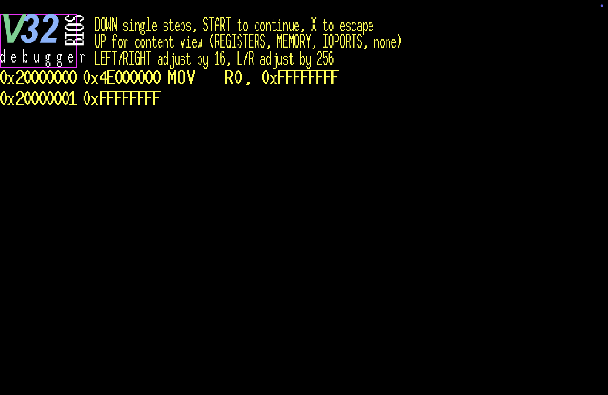
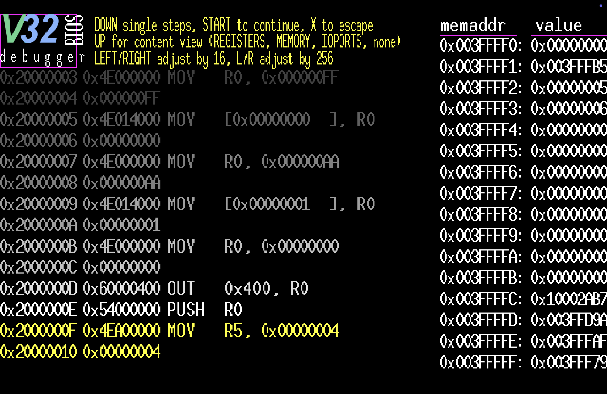

# debuggerBIOS-ng

A Vircon32 custom BIOS with the intent to provide an interactive, built-in
debugger  for use  with troubleshooting  and studying  program logic.  It
strives to provide much-desired  debugging functionality via the Vircon32
emulation environment.

This BIOS  is based on  the original `debuggerBIOS`, a  spring2026 effort
worked  on  in  my  SUNY  Corning  Community  College  CSCS2650  Computer
Organization class,  itself based on  v1.2 of the  Vircon32 StandardBios,
with liberties taken  to streamline the start-up process  by removing the
logo/animation and sounds.

It  is developed  using v25.10.29  and  later of  the Vircon32  DevTools,
although it probably will build against a version as old as v24.2.4.

It is as much a pedagogical  tool as it is a conceptual proof-of-concept,
demonstrating functional viability of  an in-environment debugger and the
various schemes undertaken to pull it  off. It CAN actually be useful for
debugging,  if one  comes  in familiar  with  the necessary  prerequisite
knowledge.

To   distinguish   `debuggerBIOS-ng`   from  the   original   class-based
`debuggerBIOS` (really  only because in-class development  stopped as the
class moved onto  their end of semester project, and  I continued to work
on  features),  the  major  feature  is  the  inclusion  of  support  for
V32-TEXT-based  C debug  information;  when operational,  this BIOS  will
allow specially-prepared V32  CARTs to be debugged against  their C code,
instead of merely  assembly. This enables the debugger to  be more useful
to a broader Vircon32 development audience, as the bulk of development in
that ecosystem is done in C.

Other modifications include a  modular code reorganization, and extending
various  debugging views  from  that  of the  original,  although due  to
continuing  to  develop  against  the class  repository,  many  of  those
features are present in the original `debuggerBIOS` too.

## SCREENSHOTS

### STARTUP

On console start, single-stepping mode is enabled; it will stop and await
user input on the first instruction of the connected cartridge:



### C DEBUGGING

Also on startup,  checks are done to  see if the CART  being debugged has
been prepared with C Debugging information. If so, a further mode will be
available, and  the ability  to toggle  it- C  debugging mode  versus ASM
debugging mode. The  `Y` button can toggle between them,  but only when C
debugging information is  available (otherwise, it is  only ASM debugging
mode).

There will  be an  addition to  the top-of-screen  instructions displayed
when this is the  case, and then the other other  real difference will be
the display of C code versus assembly code.

Sample output:


### STEPPING

Pressing `DOWN` executes  the current CART instruction,  then stopping on
the next awaiting user input:


### INFORMATION VIEWS

In addition  to single-stepping, there are  a set of resource  views that
can  be activated  by pressing  `UP` (register  view, memory  view, stack
view, various IOPorts  views), which allows for further  insight into the
operation of the CART:



## BIOS

As part of Vircon32 operations, a  BIOS/firmware is needed to perform the
essential tasks of starting up the system and system error handling.

## OPERATION

The aim of  this CustomBios is to provide an  interactive debugger within
the Vircon32 environment for the purposes of debugging cartridge code, or
merely studying the operation of the system.

Functionality includes:

  * display of offset and assembly code
  * display of line number and C code, if debugging information present
  * single-stepping through assembly code (via `DOWN`)
  * continue mode (via `START`), allowing CART to run uninterrupted
    * debugger is still present, and single-step can be re-engaged
    * press `START` again to return to single-step mode
  * escape mode (`X` button), leaving the debugger entirely
  * toggle between C and Assembly mode (`Y` button)
    * only when C debug information is found, otherwith ASM only
  * user-cycled display of various system resources (via `UP`):
    * CART register array
    * console RAM (range adjustable)
    * stack (based on `BP` and `SP` register values)
    * backtrace
    * GPU IOPorts
    * SPU IOPorts
    * INP IOPorts
    * CAR IOPorts
    * MEM IOPorts and contents

Through  the use  of  the  configured gamepad  (defaults  to gamepad  0),
various debugger features can be utilized and accessed.

NOTE:  the   debuggerBIOS-ng  gamepad  can  actually   be  configured  by
editing  the  `config.h`   file  in  the  base  of   the  repository  and
rebuilding/reinstalling the BIOS.

## LIMITATIONS

As a  BIOS, the debugger  is limited by the  what is provided  within the
Vircon32 environment. As such, debugging a  CART will be via machine code
decoded into assembly, where any  semblance of label or variable/function
naming has long been abstracted away.

Being  in-environment,  the debugger  has  no  greater access  to  system
resources than  any other BIOS or  CART running on the  system: no direct
access  to the  InstructionPointer, nor  the ability  to access  ports in
manners they aren't intended.

UNLESS: additional information has been specifically provided, outside of
the normal CART building process, to  allow for the transacting of higher
level organizations of information. Using some tools specifically created
for this purpose, the Vircon32 C compiler-generated debug information can
be used to prepare and inject the original (if reformatted) C code at the
end of the  normally generated VBIN file, appending  a special `V32-TEXT`
meant for use with the debugger, and hacking the existing header to allow
it all to be packed as normal into a Vircon32 CART.

Incorporating the C  debug data injection tools into  any CART's building
process will allow  for C-level debugging of any Vircon32  CART when this
CustomBios is installed and used in Vircon32.

## CONFIGURING VIRCON32 TO USE A CUSTOM BIOS

By default, Vircon32 will use  the `Bios/StandardBios.v32` located in the
Vircon32 Emulator directory.

To best utilize a custom BIOS:

  * copy the custom BIOS (under a unique name) into the `Bios/` directory
  * open `Config-Settings.xml` and edit the  `<bios file=` entry
    * specify the filename as it exists under the `Bios/` directory, with
      no path information (`Bios/` is assumed)

## FEATURES

debuggerBIOS-ng  presents   the  following  features,  for   an  enriched
debugging-environment Vircon32 experience.

NOTE that button presses require pressing the needed button down AND then
releasing  to  activate.  This  is  true for  ANY  of  the  buttons,  and
avoids any  trigger finger inputs,  which would lead to  inaccuracies and
overshooting of targets if not prevented in this manner.

### SINGLE STEP

Pressing `DOWN`  on the  gamepad will  execute the  currently highlighted
instruction, obtaining the next, and stopping for continued user input.

NOTE  that in  C  debugging mode,  the  actual  line of  C  code will  be
displayed instead  of the assembly instruction.  Everything is ultimately
based on the current offset of the InstructionPointer.

### INSTRUCTION HISTORY

While  single-stepping, up  to 8  instructions will  be displayed  on the
screen, with the current one to be executed at the bottom (highlighted in
yellow).

This  allows  for  context,  letting   the  user  see  a  progression  of
instructions helping  to establish the  process and progress of  the CART
logic.

### CONTINUE MODE

With  the pressing  of  the  `START` button,  the  debugger will  suspect
single-step mode,  allowing the  CART instructions to  run one  after the
other, while still being in the debugger.

The single-step  mode can be  reactivated by pressing the  `START` button
again.

### ESCAPE THE DEBUGGER

By  pressing  the `X`  button,  the  debugger  will be  entirely  exited,
reverting full and direct control to the CART.

This is meant  to allow for `debuggerBIOS-ng` to be  used as your default
BIOS, whether  or not you plan  to debug in that  particular instance. If
you don't desire to debug, simply escape the debugger.

### RESOURCE VIEWS

With  the  `UP` button,  various  system  resource  views can  be  cycled
through, including:

  * CART register view
  * system RAM view (just page 0, from 0x00000000 to 0x003FFFFF)
  * stack view (based on `BP` and `SP` values)
  * backtrace (showing subroutine/function call depth)
  * select GPU IOPorts
  * select SPU IOPorts
  * INP IOPorts
  * CAR IOPorts
  * MEM IOPort and contents
    * MEMCARD title is displayed before raw contents

By continuing to  press `UP`, each mode will by  cycled through. Once the
last mode  has been cycled, it  returns to being off,  until further `UP`
presses begin the view cycle once again.

The memory/RAM view can be adjusted via the `LEFT`/`RIGHT` (minus/plus by
16), and  `L`/`R` (minus/plus by  256) buttons  on the gamepad.  RAM will
wrap-around.

### DEBUGGER MEMORY MAP

To juggle the needs of the  debugger/BIOS and CART both needing access to
the  same system  resources,  a  memory map  was  established, which  the
debugger  enforces, with  the CART  hopefully blissfully  unaware of  its
presence:

  * `0x003FFB9F` base of cartridge stack (initial CART BP/SP)
  * `0x003FFBA0` - `0x003FFBAF` CART context register data
  * `0x003FFBB0` upper bound of debugger stack (1023 total words)
  * `0x003FFFAF` base of debugger/BIOS stack
  * `0x003FFFB0` - `0x003FFFE2` custom RAM subroutine (50 total words)
  * `0x003FFFEE` offset of current CART instruction
  * `0x003FFFEF` address of where our jumped-to routine will "return" to
  * `0x003FFFF0` - `0x003FFFFF` BIOS context register data

This  will  allow  the  debugger to  maintain  important  data,  separate
whatever the CART ROM ends up doing (provided it plays nice and just uses
BP/SP as presented).

The  one caveat  is that  the  CART being  debugged does  not attempt  to
manipulate  the stack  registers,  instead  just using  the  stack as  it
operates. Which, if normally compiled code using the C Compiler, won't be
an issue.

### CUSTOM MACHINE CODE ROUTINE

Single-stepping /  BIOS debug monitoring  is accomplished by  taking each
CART instruction  individually and  packaging it into  a custom-generated
machine code  routine (in RAM),  which is then executed,  allowing system
resources to be impacted.

The custom  routine is generated  as follows, where `instruction`  is the
current CART instruction about to be run, and `immediate`, if present, is
any immediate data associated with that instruction:

```
index                = 0;
*(code+index++)      = instruction; // instruction being processed
if (immflag         >  0)
{
    *(code+index++)  = immediate;   // immediate value of instruction
}
*(code+index++)      = 0x55400000;  // PUSH R10
*(code+index++)      = 0x4F408000;  // MOV R10, [0x003FFFEF]
*(code+index++)      = 0x003FFFEF;  // immediate data (retaddr)
*(code+index++)      = 0x09400000;  // JMP R10
*(code+index++)      = 0x00000000;  // HLT
```

This routine  is called  once context  switching from  BIOS to  CART mode
(backing up  of all  the BIOS  registers to memory,  and loaded  the CART
register backups from memory).

The  `0x003FFFEF` address  stores the  address of  our desired  returning
point,  which is  obtained during  the context  switch by  obtaining (via
inline assembly) the offset of a strategically-placed label:

```
...
"MOV [0x003FFFFE], R14" // back up BIOS to RAM
"MOV [0x003FFFFF], R15" // back up BIOS to RAM
"MOV R0, _CUSTOM_RET"   // grab offset of where we want to "return" to
"MOV [0x003FFFEF], R0"  // place it in designated memory address
"MOV R0,  [0x003FFBA0]" // restore CART register
"MOV R1,  [0x003FFBA1]" // restore CART register
...
```

The custom routine is `JMP`'ed to, then will `JMP` back via the offset of
the `_CUSTOM_RET` label,  which then leads off another  context switch to
back up the CART registers to memory, restoring BIOS registers from their
memory store.

NOTE: CART  branch instructions are  excluded from this scheme,  to avoid
jailbreaks; that is described next:

### EMULATED BRANCH INSTRUCTIONS

For  the `JMP`,  `CALL`, `RET`,  `JT`, and  `JF` branching  instructions,
there is  emulation established allowing  for the functionality  of these
instructions, without actually allowing the instructions to run.

This allows the BIOS debugging  monitor to retain control, preventing the
potential of jailbreaks.

Here is the emulation of the `JMP` instruction:

```
case OPCODE_JMP:
    if (immflag         >  0)                 // if immediate bit is set
    {
        offset           = (int *) immediate; // addr of first CART word
    }
    else
    {
        pos              = (instruction & 0x01E00000) >> 21;        
        code             = (int *) (0x003FFBA0 + pos);
        offset           = (int *) *code;
    }
    continue;
```

Of particular  note is the handling  of `CALL` and `RET`,  which required
stack emulation as well, and accomplished in C via some pointer sorcery:

```
code                 = (int *) (0x003FFBA0 + 15);
*code                = *code - 1; // CART SP = CART SP - 1 (pushing)

mem                  = (int **) &(*code);
**mem                = (int) offset; // **mem is actual data storage
```

### BACKTRACE FUNCTIONALITY

The rudimentary  backtrace functionality is accomplished  by inserting or
removing  the  subroutine offset  in  question  when  a `CALL`  or  `RET`
is  encountered,  adding  this  logic  to  the  emulation  of  those  two
instructions. Nice and neat.

The  debugger currently  supports  up  to 64  levels  of backtracing  for
subroutines.  Likely far  in  excess  of what  will  be  needed for  most
debugging sessions.

The backtrace view  can be adjusted in the same  manner as memory, stack,
and memcard views: left/right and L/R buttons to adjust offsets by 16 and
256, respectively.

### INSTRUCTION TRIGGERS

To  facilitate  some  debugger   operations,  various  system  events  of
transactions can be monitored.

For  example, using  the same  mechanism  used for  emulating the  branch
instructions, we can  be on the lookout for `WAIT`  or even certain `OUT`
instructions, performing  conditional steps at the  debugger allowing the
whole scheme to work.

Note that  this is in  no way user-accessible. It  is within the  code of
debuggerBIOS itself.  Merely documented  here for covering  the technical
features of the BIOS.

### DECODED ASSEMBLY INSTRUCTIONS 

The debugger  will presented each  machine code instruction in  a decoded
assembly form,  allowing the  user to  view the  progression of  logic in
their CART.

Obviously  any decoding  will  not  know about  any  of your  established
labels. You will just see raw hex offsets. No way around this.

### EMBEDDED C CODE

If you use the data injection  tools also provided here, integrating them
into your  CART build process, your  CART will also contain  each line of
your C code,  which the debugger can  look up and display in  lieu of the
assembly.

This  is  the result  of  referencing  information  in the  Compiler  and
Assembler-generated `.debug` files, which  contain linkages showing which
line in what environment maps to in  the other. Ultimately, we get to the
actual offset in memory, which is the foundation of the magic.

At the  end of specially-prepared CARTs,  there will be a  new "V32-TEXT"
header (as viewed from a hex viewer):

  * "V32-TEXT" (2 words)
  * quantity of offsets involved (1 word)
  * "array" of offset words

After this begins the C code  injected into the cartridge. It follows the
form:

  * number of words the line of code (string) occupies
  * a set of words containin the packed string data
    * packed, as in ALL bytes of the word are used, to save space
    * an additional `z_print_at ()` function created to handle the
      display of this packed string data

Finally, at the very end, the last  word appended to the CART will be the
total size (in  words) of the appended/injected data,  which the debugger
will use to backtrack to its start to allow the whole process to work.

Really  quite nice,  thanks  in part  to Vircon32's  `CAR_ProgramROMSize`
IOPort, which will provide us with that last word offset (just before any
VTEX data starts), and the debugger  just calls on that, reads the value,
calculates an address, and we're off to the races.

### CART DATA INJECTION

To make the C debugging mode possible,  the actual C code of the CART has
to  be  present WITHIN  the  Vircon32  environment. This  isn't  normally
possible via the standard build process,  so a scheme had to be concocted
to make it possible.

It consists really of two pieces of data, across various actions:

  * offsets (gleaned from the compiler/assembler `.debug` files
  * polished lines of C code as byte-packed words

These offsets and  strings are appended to the end  of the assembled VBIN
file (assembled with the `-g program` argument), kicked off by a visually
distinctive  "V32-TEXT" string  to aid  in  navigation when  using a  hex
viewer.

Once all  the data has  been appended,  an offset representing  the total
size of the data  injection is added as the last word,  and then the size
word in  the "V32-VBIN"  header is modified,  allowing `packrom`  to work
without complaint.

The original program  being built is otherwise unaware  of this addition.
And  indeed,  the  CART  will  still  run  and  work  as  normal  in  any
other Vircon32  BIOS. Just,  in combination with  `debuggerBIOS-ng`, that
information will then be used to augment the debuggin experience.

A  set of  bash  scripts  start the  process,  by  reading and  collating
the  data within  the  Compiler `.debug`  and  Assembler `.debug`  files,
establishing  a path  of connectivity  from  line of  C code  to line  of
assembler to ultimate memory offset.

The   line   of   C   code   is  then   read   and   polished   (removing
spacing/indentation).

A C  program (`bincode.c`) was designed  to handle some of  the low-level
binary transactions needed to produce viable data that can be appended to
the VBIN file. A number  of these transactions involve encoding resultant
data in  little endian orientation  so the  data can be  predictably read
from within the Vircon32 environment.

### ENHANCED ERROR HANDLING

Included in  this custom BIOS  is the enhanced  `error_handler()` routine
from the spring2025  Computer Organization effort `BiosWithoutLogoDebug`,
so in the event an instruction leads  to a system error, the user of this
custom BIOS will benefit from that functionality as well.

Any decoded instruction  list on error will be based  on the CART offset,
versus its  actual triggerpoint of the  in-RAM custom routine (if  in the
debugger).

Do NOTE: the port name translations are not included in this custom BIOS;
only  the raw  hex  values will  be  seen  (this is  a  consequence of  a
reimplemented  `decode()`  function  that  does  not  have  such  support
implemented.

No  decoding  will  be  done for  BIOS-originating  errors,  for  obvious
reasons.

## CREDITS

Due  to being  based  on  `debuggerBIOS`, itself  based  on the  Vircon32
`StandardBios`,  along  with  the enhanced  `error_handler()`  code  from
`BiosWithoutLogoDebug`,  this effort  is  entirely made  possible by  the
community  and code  sharing enabled  by  the Open  Source philosophy  in
practice, allowing us to stand on the shoulders of giants.

`debuggerBIOS-ng` is developed by Matthew Haas (github: @wedge1020), with
appreciation and thanks to Carra for creating Vircon32, the StandardBios,
and  enduring  my various  requests  for  functionality, questions  about
low-level Vircon32  operations, and crazy  schemes to do these  things on
his developed platform.

### DEBUGGERBIOS

All    existing    credits    for    the    `StandardBios`    BIOS    and
`BiosWithoutLogoDebug` BIOS, with further modifications from:

* Matthew Haas (github: @wedge1020)
* Blaize Patricelli (github: @BlaizePatricelli80)
* Hjalmer Jacobson (github: @game123shark)
* Kenneth Bird (github: @Darkjet21)
* Monti Emery Jr (github: @Tallmonti8)
* Tyler Strickland (github: @Tylermanguy58)

...  as part  of our  spring2026  semester explorations  in our  Computer
Organization class at SUNY Corning Community College.

### BIOSWITHOUTLOGODEBUG

All  existing  credits  for  the  `BiosWithoutLogo`  BIOS,  with  further
modifications from:

* Matthew Haas (github: @wedge1020)
* Thomas Kastner (github: @t0mmyka)
* Connor Grant (github: @Cgrant2)
* Brandon Dildine (github: @BDildine)

...  as part  of our  spring2025  semester explorations  in our  Computer
Organization class at SUNY Corning Community College.

## LICENSE

This program  is free and open  source. It is offered  under the 3-Clause
BSD License, which full text is the following:
 
```
    Copyright 2026 Matthew Haas (debuggerBIOS-ng)
    All rights reserved.
```

Redistribution  and use  in  source  and binary  forms,  with or  without
modification, are  permitted provided  that the following  conditions are
met:

1. Redistributions of source code must retain the above copyright notice,
this list of conditions and the following disclaimer.

2.  Redistributions in  binary form  must reproduce  the above  copyright
notice,  this list  of conditions  and  the following  disclaimer in  the
documentation and/or other materials provided with the distribution.

3.  Neither  the name  of  the  copyright holder  nor  the  names of  its
contributors may be used to endorse or promote products derived from this
software without specific prior written permission.

THIS SOFTWARE IS  PROVIDED BY THE COPYRIGHT HOLDERS  AND CONTRIBUTORS "AS
IS" AND ANY EXPRESS OR IMPLIED WARRANTIES, INCLUDING, BUT NOT LIMITED TO,
THE IMPLIED  WARRANTIES OF MERCHANTABILITY  AND FITNESS FOR  A PARTICULAR
PURPOSE  ARE  DISCLAIMED. IN  NO  EVENT  SHALL  THE COPYRIGHT  HOLDER  OR
CONTRIBUTORS  BE LIABLE  FOR ANY  DIRECT, INDIRECT,  INCIDENTAL, SPECIAL,
EXEMPLARY,  OR  CONSEQUENTIAL DAMAGES  (INCLUDING,  BUT  NOT LIMITED  TO,
PROCUREMENT  OF SUBSTITUTE  GOODS  OR  SERVICES; LOSS  OF  USE, DATA,  OR
PROFITS; OR  BUSINESS INTERRUPTION) HOWEVER  CAUSED AND ON ANY  THEORY OF
LIABILITY,  WHETHER IN  CONTRACT,  STRICT LIABILITY,  OR TORT  (INCLUDING
NEGLIGENCE  OR OTHERWISE)  ARISING IN  ANY  WAY OUT  OF THE  USE OF  THIS
SOFTWARE, EVEN IF ADVISED OF THE POSSIBILITY OF SUCH DAMAGE.
